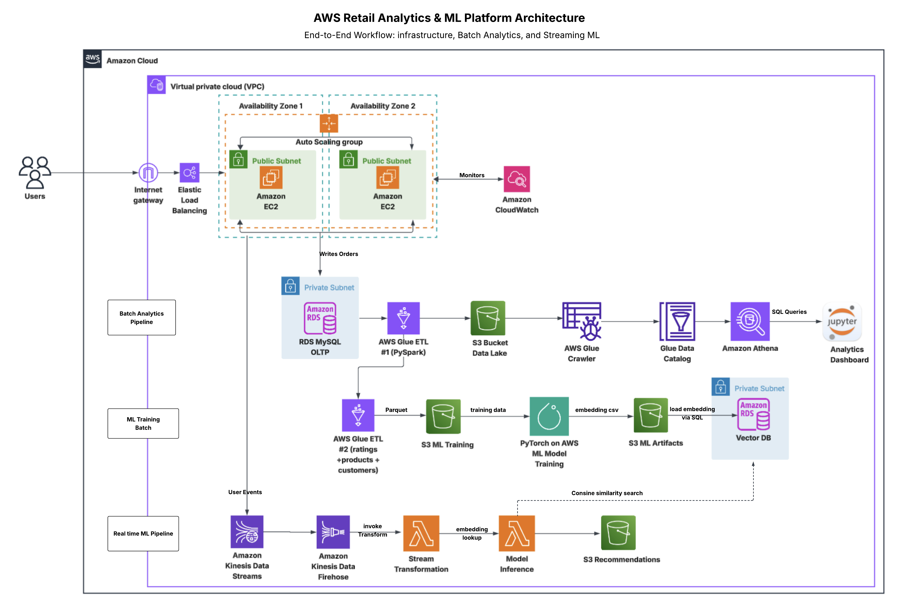
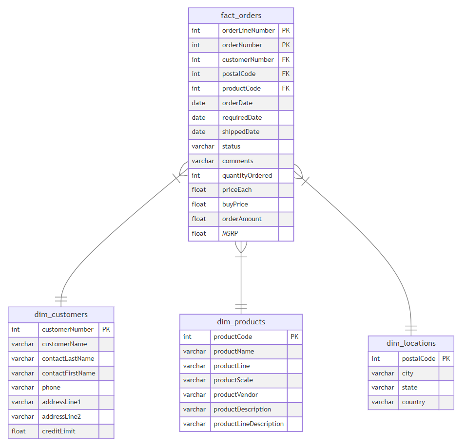

<div align="center">

# 🏗️ Retail Analytics Platform

**Batch ETL & Real-Time ML Recommendations on AWS**

A production‑grade data pipeline that decouples analytics from OLTP, transforms raw retail data into a star schema, and delivers real‑time product recommendations all provisioned with Terraform IaC.

**Tech stack:** Batch ETL (RDS → Glue → S3 → Athena) and real‑time ML recommendations (Kinesis → Lambda → pgvector) on AWS.


[](https://www.terraform.io/)
[](https://aws.amazon.com/)
[](https://aws.amazon.com/glue/)
[](https://aws.amazon.com/athena/)
[](https://aws.amazon.com/kinesis/)
[](https://github.com/pgvector/pgvector)
[](https://opensource.org/licenses/MIT)

</div>

## 💡 Problem Statement

A retail company runs expensive analytical queries directly against its production OLTP database, causing performance degradation and scalability bottlenecks. This project solves that by implementing a fully decoupled, cloud‑native analytics and recommendation platform on AWS:

1. **Batch ETL Pipeline** — Transforms operational data into analytics-ready formats by extracting data from **RDS MySQL**, processing it using **AWS Glue (PySpark)**, storing it in **Parquet star schema** format on **S3**, and enabling analytical queries through **Athena**.

2. **Real-Time ML Recommendations** — Delivers low-latency personalization by ingesting live user activity via **Kinesis Data Streams**, running embedding-based inference in **Lambda** against a **pgvector database**, and delivering recommendation outputs to **S3** via **Firehose**.

3. **Resilient Web Infrastructure** — Ensures production-grade availability and scalability through an **Application Load Balancer** distributing traffic across **Multi-AZ EC2 Auto Scaling instances**, with **CloudWatch** providing monitoring and operational visibility aligned with AWS Well-Architected best practices.

## 🔄 End-to-End Data Flow

The three components form a single unified system: the web tier (ALB + EC2 Auto Scaling) serves the retail application and generates order and event data → the batch ETL pipeline nightly extracts that data from RDS MySQL and transforms it into a star schema for analytics → the streaming pipeline simultaneously processes real-time browse events through Kinesis, performs embedding-based inference against pgvector, and delivers personalized recommendations back to S3.

## 🏛️ Architecture


Everything is provisioned using **Terraform** (Infrastructure as Code), organized into reusable modules.

## 🛠️ Tech Stack

| Layer | Services |
|-------|----------|
| **Source** | Amazon RDS (MySQL) |
| **ETL** | AWS Glue (PySpark) |
| **Storage** | Amazon S3 (Parquet + Snappy) |
| **Serving** | Amazon Athena |
| **Streaming** | Kinesis Data Streams, Kinesis Firehose |
| **Compute** | AWS Lambda, EC2 Auto Scaling |
| **Vector DB** | RDS PostgreSQL + pgvector |
| **Networking** | VPC, ALB, Security Groups, Multi-AZ |
| **Monitoring** | Amazon CloudWatch |
| **IaC** | Terraform (modular HCL), AWS CloudFormation |

## 📁 Project Structure

```
aws-retail-data-pipeline/
│
├── batch-etl-pipeline/
│   ├── terraform/
│   │   ├── glue.tf               # Glue job, crawler, catalog, RDS connection
│   │   ├── iam_roles.tf
│   │   ├── network.tf
│   │   ├── variables.tf
│   │   ├── backend.tf
│   │   └── assets/
│   │       └── glue_job.py       # PySpark ETL → Star Schema
│   ├── scripts/setup.sh
│   ├── data/mysqlsampledatabase.sql
│   └── dashboard.ipynb           # Athena analytics & visualizations
│
├── streaming-recommendation-pipeline/
│   ├── terraform/
│   │   ├── main.tf               # Root: etl → vector_db → streaming
│   │   ├── outputs.tf
│   │   ├── variables.tf
│   │   ├── backend.tf
│   │   ├── modules/
│   │   │   ├── etl/              # Glue ETL for ML training data
│   │   │   ├── vector-db/        # RDS PostgreSQL + pgvector
│   │   │   └── streaming-inference/ # Kinesis + Lambda
│   │   └── assets/
│   │       ├── glue_job/etl_job.py
│   │       └── transformation_lambda/main.py
│   ├── scripts/setup.sh
│   └── sql/embeddings.sql        # pgvector setup & S3 import
│
├── app-infrastructure/
│   ├── template.yaml             # CloudFormation: ALB + EC2 Auto Scaling + CloudWatch
│   ├── template.json             # same stack in JSON format
│
└── images/                       # Architecture diagrams
```

## 🚀 Getting Started

### Prerequisites

- **Terraform** ≥ 1.0
- **AWS CLI** v2 (configured with appropriate IAM permissions)
- **MySQL** & **psql** clients
- **Python** 3.8+

### 1. Deploy the App Infrastructure

```bash
aws cloudformation deploy \
  --template-file app-infrastructure/template.yaml \
  --stack-name retail-app-infra \
  --capabilities CAPABILITY_IAM
```

### 2. Deploy the Batch ETL Pipeline

```bash
# Set environment variables
export DB_USERNAME=your_username
export DB_PASSWORD=your_password

source batch-etl-pipeline/scripts/setup.sh
cd batch-etl-pipeline/terraform
terraform init && terraform plan && terraform apply

# Trigger the ETL job
aws glue start-job-run --job-name <project>-etl-job | jq -r '.JobRunId'
```

### 3. Deploy the Streaming Recommendation Pipeline

```bash
export DB_USERNAME=your_username
export DB_PASSWORD=your_password

source streaming-recommendation-pipeline/scripts/setup.sh
cd streaming-recommendation-pipeline/terraform

# Modules deploy sequentially via depends_on: etl → vector_db → streaming_inference
terraform init && terraform apply

# Load embeddings into pgvector
psql --host=<VectorDBHost> --username=postgres --port=5432
\i '../sql/embeddings.sql'
```

## 📊 Data Model

Transforms 8 normalized OLTP tables into an analytics-ready **star schema**:



## 🔑 Key Design Decisions

- **Modular Terraform** — Three composable modules (`etl`, `vector-db`, `streaming-inference`) with explicit `depends_on` ordering for safe sequential deployment
- **Parquet + Snappy** — Columnar storage with compression for cost-efficient Athena queries (pay-per-query)
- **pgvector over managed Vector DB** — Cost-effective embedding similarity search on RDS PostgreSQL without the overhead of a dedicated vector store
- **Serverless streaming** — Lambda + Firehose auto-scales with traffic; zero idle cost
- **Security-first** — Credentials injected via environment variables, ALB security groups restrict inbound traffic, VPC isolation for all data resources
- **Validated under load** — Apache Benchmark stress test (1M requests, 200 concurrent connections) confirmed CloudWatch-triggered Auto Scaling fires correctly and scales back in after load drops

## 📝 License
This project is licensed under the **MIT License**. See the [LICENSE](LICENSE) file for more details.

> ### 🌟 Contributions Welcome  
> Built with ❤️ on AWS to make retail analytics & real‑time recommendations feel effortless.


